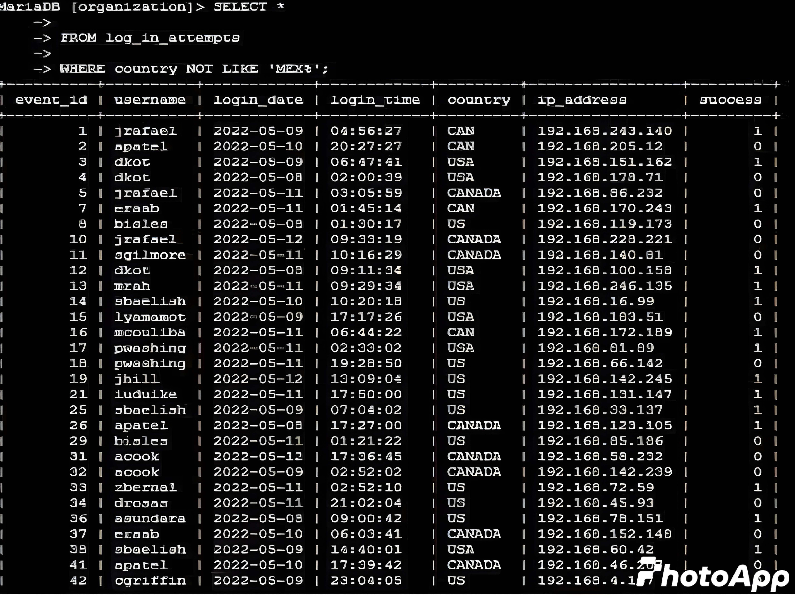

# Project: Apply Filters to SQL Queries  

**Linux & SQL – February 2025**  

---

## 📌 Overview
This project demonstrates how SQL filters can be applied to investigate suspicious activity in system logs.  
The focus is on learning how to use **AND**, **OR**, and **NOT** operators to filter information in SQL queries.  

In this scenario, I worked with the `employees` and `log_in_attempts` tables to identify potential security incidents, such as failed login attempts occurring outside of normal business hours.  

This work can be included in a professional cybersecurity portfolio to highlight my SQL investigation skills for recruiters and future employers.  

---

## 🎯 Scenario
You are a security professional at a large organization. Part of your responsibilities is to monitor and investigate unusual login behavior.  

Recently, there was a concern about failed login attempts occurring after normal business hours.  
To investigate, I used SQL to filter and retrieve relevant information from the database tables.  

---

## Part 1: Retrieve After-Hours Failed Login Attempts  

### 📝 Task
Query the `log_in_attempts` table to identify all **failed login attempts** that happened **after 18:00 (6:00 PM)**.  


  

### 🖥️ SQL Query
```sql
SELECT *
FROM log_in_attempts
WHERE login_time > '18:00'
AND (success = 0 OR success = FALSE);

```
### Part 2: Retrieve Login Attempts on Specific Dates  

### 📝 Task  
A suspicious event occurred on **2022-05-09**. To investigate, I needed to review all login attempts that occurred on that day **and the day before (2022-05-08)**.  


### 🖥️ SQL Query  
```sql
SELECT *
FROM log_in_attempts
WHERE login_date = '2022-05-09'
   OR login_date = '2022-05-08';


```
---

## Part 3: Retrieve Login Attempts Outside of Mexico  

### 📝 Task  
There has been suspicious activity with login attempts, but the team determined that this activity did **not** originate in Mexico.  
To investigate, I needed to review all login attempts that occurred **outside of Mexico**.  

The `country` column contains values such as `MEX` or `MEXICO`. To filter all non-Mexico attempts, I used the **NOT** operator along with the **LIKE** keyword.  



### 🖥️ SQL Query  
```sql
SELECT *
FROM log_in_attempts
WHERE country NOT LIKE 'MEX%';

```
---

## Part 4: Retrieve Employees in Marketing  

### 📝 Task  
The security team wants to perform updates on specific employee machines in the **Marketing department**.  
My responsibility was to query the `employees` table to identify all Marketing employees who work in the **East building**.  

The `department` column contains values that include "Marketing", and the `office` column contains office locations like `East-170` or `East-320`.  
To capture all Marketing employees in East offices, I used the **LIKE** operator with `%`.  

### 🖥️ SQL Query  
```sql
SELECT *
FROM employees
WHERE department = 'Marketing'
  AND office LIKE 'East-%';
```


### 🔍 Explanation of the Query  

- `department = 'Marketing'` → filters only employees in the Marketing department.  
- `office LIKE 'East-%'` → retrieves employees located in the East building, no matter which floor or room number.  
- `AND` ensures the results only include employees who are in **both** Marketing **and** East offices.  
- ✅ This query retrieves employees in the Marketing department located in the East building, using the **AND** operator to filter by department and office with the `"East%"` pattern.


---

## Part 5: Retrieve Employees in Finance or Sales  

### 📝 Task  
The team needs to perform a security update on machines for employees in the **Sales** and **Finance** departments.  
My responsibility was to query the `employees` table to identify all employees in either of these two departments.  

### 🖥️ SQL Query  
```sql
SELECT *
FROM employees
WHERE department = 'Finance'
   OR department = 'Sales';
```
### 🔍 Explanation of the Query

- department = 'Finance' → retrieves employees in the Finance department.  
- department = 'Sales' → retrieves employees in the Sales department.  
- The OR operator ensures that the results include employees from either department.  
- ✅ This query pulls all employees working in Finance or Sales, making it easier to target these groups for security updates.  

---

## Part 6: Retrieve All Employees Not in IT  

### 📝 Task  
The team needs to perform a security update on machines for all employees **except those in the IT department**.  
To achieve this, I queried the `employees` table to exclude IT employees while including everyone else.  

### 🖥️ SQL Query  
```sql
SELECT *
FROM employees
WHERE department NOT LIKE 'IT';
```
### 🔍 Explanation of the Query

- `department NOT LIKE 'IT'` → excludes employees in the IT department.  
- This ensures all other departments are included in the results.  
- ✅ This query isolates employees outside of IT so the team can focus security updates on the correct groups.  
- The query retrieves all employees who are not in the Information Technology department. To do this, I started by selecting all records from the `employees` table. Then, I used a `WHERE` clause with the **NOT** operator to filter out those in the Information Technology department.  
- For instance, if the query is based on an exact match, it will exclude only employees in the department named exactly `'Information Technology'`. However, if a more flexible approach is used (like filtering with a pattern), it would exclude not only `'Information Technology'` but also any departments that start with those words, such as `'Information Technology Support'` or `'Information Technology Services'`. This ensures all variations of the department name are excluded from the results.  
