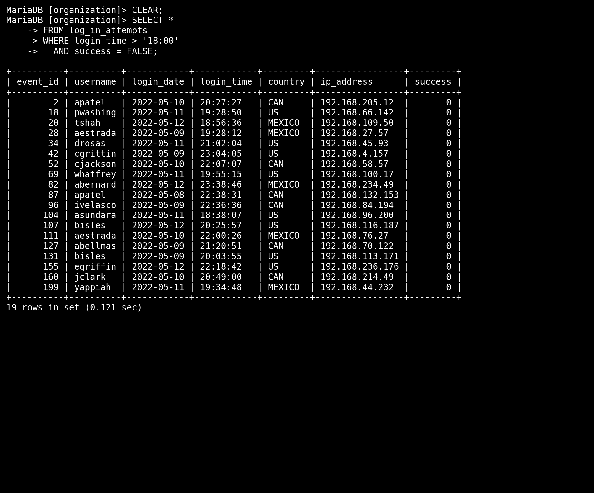
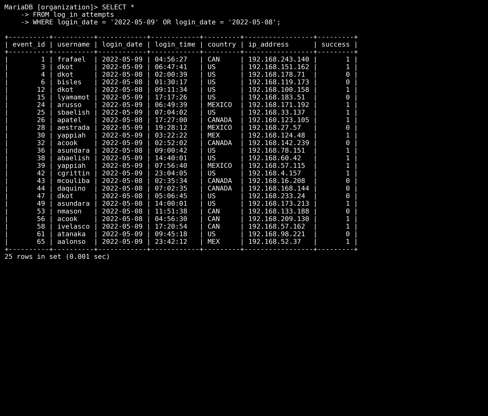

# Project 5: Apply Filters to SQL Queries  

**Linux & SQL – February 2025**  

---

## 📌 Overview
This project demonstrates how SQL filters can be applied to investigate suspicious activity in system logs.  
The focus is on learning how to use **AND**, **OR**, and **NOT** operators to filter information in SQL queries.  

In this scenario, I worked with the `employees` and `log_in_attempts` tables to identify potential security incidents, such as failed login attempts occurring outside of normal business hours.  

This work can be included in a professional cybersecurity portfolio to highlight my SQL investigation skills for recruiters and future employers.  

---

## 🎯 Scenario
You are a security professional at a large organization. Part of your responsibilities is to monitor and investigate unusual login behavior.  

Recently, there was a concern about failed login attempts occurring after normal business hours.  
To investigate, I used SQL to filter and retrieve relevant information from the database tables.  

---

## Part 1: Retrieve After-Hours Failed Login Attempts  

### 📝 Task
Query the `log_in_attempts` table to identify all **failed login attempts** that happened **after 18:00 (6:00 PM)**.  



  

### 🖥️ SQL Query
```sql
SELECT *
FROM log_in_attempts
WHERE login_time > '18:00'
AND (success = 0 OR success = FALSE);

```
### Part 2: Retrieve Login Attempts on Specific Dates  

### 📝 Task  
A suspicious event occurred on **2022-05-09**. To investigate, I needed to review all login attempts that occurred on that day **and the day before (2022-05-08)**.  




### 🖥️ SQL Query  
```sql
SELECT *
FROM log_in_attempts
WHERE login_date = '2022-05-09'
   OR login_date = '2022-05-08';
